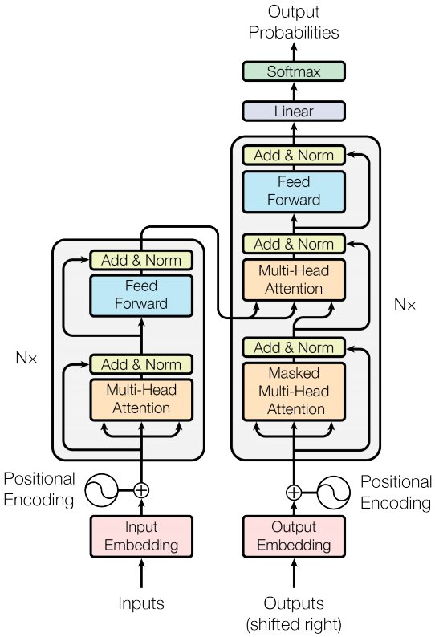

# Transformer implementation in tensorflow 
##  French/english translation 
---
```diff
- The repository is currently under development. Training trials will start: before mid-june.
```
This repository contains an implementation of the transformer model for translation using Tensorflow, based on the original paper ["Attention is All You Need"](https://arxiv.org/abs/1706.03762) by Vaswani et al. The transformer model is a neural network architecture that has been shown to achieve state-of-the-art results in many natural language processing (NLP) tasks, including machine translation.

## The original transformer architectur



The transformer model consists of several components that work together to process and transform the input data. Here is a brief description of each component:

- ***Embedding:*** The embedding layer converts token IDs into dense vectors, capturing the semantic meaning of each token.  
- ***Positional Encoding:*** The positional encoding layer adds position information to the token embeddings, helping the model understand the order of tokens in a sequence.  
- ***Pointwise Feed Forward Network:*** This network applies a non-linear transformation to each position independently, allowing the model to capture complex patterns within the sequence.  
- ***Multi-Head Attention:*** The multi-head attention mechanism attends to different positions of the input sequence simultaneously, capturing both local and global dependencies.  
- ***Sublayer Logic:*** The sublayer logic combines the output of the multi-head attention and pointwise feed forward network using residual connections and layer normalization.  
- ***Encoder:*** The encoder consists of multiple encoder layers, each applying the sublayer logic to process the input sequence.  
- ***Decoder:*** The decoder also consists of multiple decoder layers, which perform similar operations to the encoder but with the addition of an attention mechanism over the encoder output.  
- ***Decoder Generator:*** The decoder generator projects the decoder output into a probability distribution over the target vocabulary, allowing the model to generate target tokens.  

## Repository Structure
The repository is organized as follows:

├── data/  
│   ├── img/  
│   │   └── arch.jpg  
├── models/  
│   ├── \_\_init\_\_.py  
│   ├── embedding.py  
│   ├── positional_encoding.py  
│   ├── pointwise.py  
│   ├── multi_head_attention.py  
│   ├── sublayerlogic.py  
│   ├── encoder.py  
│   ├── decoder.py  
│   ├── decoder_generator.py  
│   └── transformer  
├── src/  
│   ├── data_handler.py  
│   ├── train_model.py  
│   ├── utils_model.py  
├── tests/  
│   ├── unit_tests.py  
├── notebook/  
│   ├── model_training.ipynb  
│   ├── evaluation.ipynb  
│   ├── pretrained_model_usage.ipynb  
│   └── ...  
├── config.py  
├── requirements.txt  
├── README.md  

## Requirements
```shell
pip -r install requirements.txt
```
## Run
**Currently under development**
A guide through notebook and cli commands approaches are being developped for:
- *Training*
- *Evaluation*
- *Inference*

## Ambition

Our ambition is to create a GitHub repository where we implement transformer models for translation tasks. Through this project, we aim to deepen our understanding of the genius behind the attention mechanism and its profound impact on generative artificial intelligence.

One of our primary goals is to experiment with the transformer architecture by testing and training it with various parameters such as the number of layers, number of attention heads, and model dimensions. By doing so, we aim to gain quantitative insights into the training process and optimize the models' performance. We plan to explore different datasets and utilize different GPUs to conduct comprehensive experiments and gather valuable empirical evidence.

In addition to studying existing research on the subject, we also aspire to explore the capabilities of generative models like GPT (decoder) and BERT (encoder), as well as novel approaches. By focusing on learning rate, optimizer selection, and loss function choices, we aim to understand their impacts on evaluation metrics such as BLEU score, overall performance, training time, and inference time. Our objective is to gain a deep understanding of these models' behavior and identify optimal configurations.

#### Expanding to Text-to-Image, Text-to-Audio, and Text-to-Video:

In addition to translation tasks, we also plan to extend our exploration to other modalities, such as text-to-image, text-to-audio, and text-to-video models. We aim to investigate how the attention mechanism can be effectively utilized in these domains and its role in generating high-quality outputs. By adapting the transformer architecture and experimenting with different input and output modalities, we strive to uncover the potential of attention-based models in generating diverse and creative outputs.

Through rigorous experimentation, comprehensive analysis, and a focus on multiple modalities, we wish to understand and why not contribute to the field of natural language processing and generative AI. In long term, our ultimate goal is to advance the understanding and practical applications of attention mechanisms across various domains, leading to innovative solutions and pushing the boundaries of generative models.

## References
- Vaswani, A., Shazeer, N., Parmar, N., Uszkoreit, J., Jones, L., Gomez, A. N., ... & Polosukhin, I. (2017). Attention is all you need. In Advances in neural information processing systems (pp. 5998-6008).
